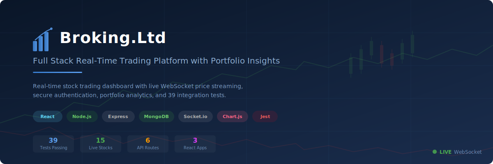

<p align="center">
  
</p>

# Broking.Ltd — Full Stack Real-Time Trading Platform


A production-grade stock trading and portfolio management platform built with React, Node.js, Express, MongoDB, and Socket.io. Features real-time stock price streaming, secure session-based authentication, paginated order management, portfolio analytics with Chart.js, Swagger API docs, Winston logging, 39 integration tests, and CI/CD via GitHub Actions.

---

## Architecture

```
┌───────────────────────┐       ┌───────────────────────┐
│   Frontend (React)    │       │  Dashboard (React)    │
│   Landing Page        │       │  Trading Interface    │
│   Port: 3000          │       │  Port: 3001           │
└──────────┬────────────┘       └──────────┬────────────┘
           │                               │
           └───────────────┬───────────────┘
                           │ REST API + WebSocket
               ┌───────────▼───────────┐
               │   Backend (Express)   │
               │   API + Auth + WS     │
               │   Port: 3002          │
               └───────────┬───────────┘
                           │
               ┌───────────▼───────────┐
               │      MongoDB          │
               │   Users, Holdings,    │
               │   Orders, Positions   │
               └───────────────────────┘
```

---

## Tech Stack

### Backend
- **Node.js** + **Express.js** — REST API
- **MongoDB** + **Mongoose** — Database with indexed schemas
- **Passport.js** — Session-based authentication
- **Socket.io** — Real-time price streaming via WebSocket
- **Joi** — Request validation
- **Helmet** — HTTP security headers
- **express-rate-limit** — Brute-force protection
- **Winston** — Structured logging with file rotation
- **Swagger UI** — Interactive API documentation at `/api/docs`
- **Jest** + **Supertest** — 39 integration tests

### Frontend (Landing Page)
- **React 18** + **React Router DOM v7**
- **Axios** with centralized API config
- **Bootstrap 5** — Responsive layout

### Dashboard (Trading Interface)
- **React 18** + **React Router DOM v6**
- **Material UI v5** — Components and icons
- **Chart.js** + **react-chartjs-2** — Bar and doughnut charts
- **Socket.io-client** — Live price feed via WebSocket

---

## Features

### Landing Page
- Responsive hero, awards, statistics, education sections
- Product showcase, pricing, about and team pages
- Support portal with ticket creation
- Sign up / login with client-side validation

### Trading Dashboard
- **Live Watchlist** — Real-time price updates via WebSocket with search filter
- **Holdings** — Table with computed P&L, investment summary, bar chart
- **Orders** — Paginated order history with timestamps and status
- **Positions** — Open positions fetched from API
- **Summary** — Dynamic equity overview computed from real holdings data
- **Buy Modal** — Place orders with validation and error feedback
- **Logout** — Profile dropdown with session logout

### Security & Architecture
- Routes / Controllers / Middleware / Validation layered architecture
- All trading endpoints require authentication
- User-scoped data isolation (userId on every model)
- Joi validation on all inputs (signup, login, orders, query params)
- Rate limiting: 10 auth attempts / 15min, 30 orders / min
- Helmet security headers, CORS whitelist
- Request ID tracking via `X-Request-Id` header
- Graceful shutdown (SIGTERM/SIGINT)

---

## Project Structure

```
├── backend/
│   ├── app.js                          # Express app factory (testable)
│   ├── index.js                        # Server entry + WebSocket init
│   ├── config/index.js                 # Environment config
│   ├── controllers/                    # Auth, Holdings, Orders, Positions
│   ├── routes/                         # Route definitions with middleware
│   ├── middleware/
│   │   ├── auth.js                     # requireAuth guard
│   │   ├── errorHandler.js             # Global error handler
│   │   ├── rateLimiter.js              # Rate limiting (general, auth, orders)
│   │   ├── requestId.js                # Request ID tracking
│   │   └── validate.js                 # Joi validation middleware
│   ├── model/                          # Mongoose models
│   ├── schemas/                        # Mongoose schemas with indexes
│   ├── validations/                    # Joi schemas (auth, orders)
│   ├── socket/index.js                 # Socket.io real-time price engine
│   ├── swagger/                        # OpenAPI spec + Swagger UI config
│   ├── utils/
│   │   ├── AppError.js                 # Custom error classes
│   │   ├── logger.js                   # Winston logger
│   │   └── response.js                 # Standardized JSON responses
│   └── tests/                          # 39 integration tests
│
├── frontend/
│   └── src/
│       ├── landing_page/               # Home, About, Products, Pricing, Support
│       │   ├── signup/Signup.js
│       │   └── login/Login.js
│       ├── utils/api.js                # Axios instance with interceptors
│       └── index.js                    # App entry + routes
│
├── dashboard/
│   └── src/
│       ├── components/                 # Dashboard, Holdings, WatchList, Orders, etc.
│       ├── hooks/useMarketData.js      # WebSocket hook for live prices
│       ├── utils/api.js                # Axios instance with interceptors
│       └── index.js                    # Auth guard + routes
│
└── .github/workflows/ci.yml           # GitHub Actions CI pipeline
```

---

## Getting Started

### Prerequisites
- **Node.js** v18+ and **npm**
- **MongoDB** (Atlas cluster or local instance)

### 1. Clone and install

```bash
git clone <your-repo-url>
cd "Full Stack Real-Time Trading Platform with Portfolio Insights"
```

### 2. Backend

```bash
cd backend
npm install
cp .env.example .env    # Edit with your MongoDB URI and session secret
npm run dev              # Starts on http://localhost:3002
```

### 3. Frontend

```bash
cd frontend
npm install
npm start                # Starts on http://localhost:3000
```

### 4. Dashboard

```bash
cd dashboard
npm install
npm start                # Starts on http://localhost:3001
```

Run all three in separate terminals.

---

## Environment Variables

Create `backend/.env` (see `.env.example`):

| Variable | Description | Required |
|---|---|---|
| `MONGO_URL` | MongoDB connection string | Yes |
| `SESSION_SECRET` | Secret for session cookie signing | Yes |
| `PORT` | Backend port (default: 3002) | No |
| `NODE_ENV` | `development` / `production` / `test` | No |
| `CLIENT_URL_FRONTEND` | Frontend URL for CORS (default: `http://localhost:3000`) | No |
| `CLIENT_URL_DASHBOARD` | Dashboard URL for CORS (default: `http://localhost:3001`) | No |

---

## API Endpoints

Full interactive docs available at **`http://localhost:3002/api/docs`** (Swagger UI).

### Authentication

| Method | Endpoint | Description | Auth |
|---|---|---|---|
| `POST` | `/api/auth/signup` | Register new user | No |
| `POST` | `/api/auth/login` | Login and create session | No |
| `POST` | `/api/auth/logout` | Destroy session | Yes |
| `GET` | `/api/auth/user` | Get current user profile | Yes |

### Portfolio

| Method | Endpoint | Description | Auth |
|---|---|---|---|
| `GET` | `/api/holdings` | Get holdings with P&L summary | Yes |
| `GET` | `/api/positions` | Get open positions | Yes |
| `GET` | `/api/orders?page=1&limit=20` | Get paginated orders | Yes |
| `POST` | `/api/orders` | Place a new order | Yes |

### Other

| Method | Endpoint | Description |
|---|---|---|
| `GET` | `/health` | Health check with DB status and memory |
| `GET` | `/api/docs` | Swagger UI documentation |

### Example: Place Order

```json
POST /api/orders
{
  "name": "INFY",
  "qty": 10,
  "price": 1555.45,
  "mode": "BUY"
}
```

Response:
```json
{
  "success": true,
  "data": {
    "order": {
      "id": "...",
      "name": "INFY",
      "qty": 10,
      "price": 1555.45,
      "mode": "BUY",
      "status": "EXECUTED",
      "createdAt": "2026-03-24T..."
    }
  }
}
```

---

## Testing

```bash
cd backend
npm test                # Run all 39 tests
npm run test:coverage   # Run with coverage report
npm run test:watch      # Watch mode
```

Tests use **MongoMemoryServer** — no external database required.

```
Test Suites: 6 passed, 6 total
Tests:       39 passed, 39 total
```

---

## WebSocket — Live Market Data

The backend streams simulated stock prices via Socket.io every 2 seconds.

**Events:**
- `market:prices` — Full price snapshot on connect
- `market:update` — Price deltas every 2 seconds

The dashboard's `useMarketData` hook consumes these events and updates the watchlist in real-time.

